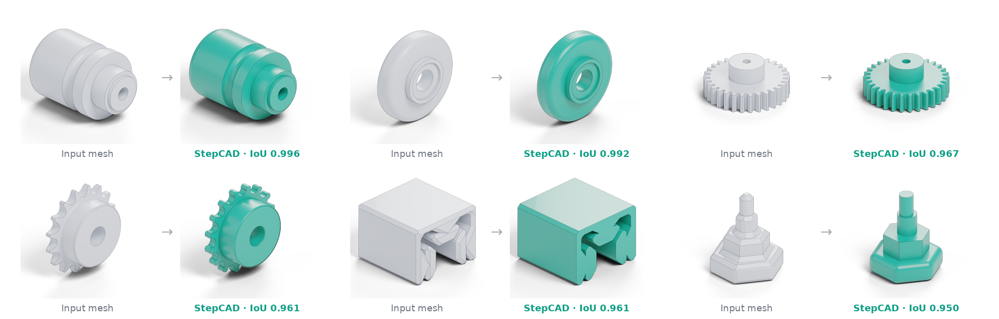

<div align="center">

## StepCAD: Mesh-to-CAD Code Generation via LLM Policy and Geometry-Guided Search

> Ghadi Nehme<sup>1</sup>, Faez Ahmed<sup>1</sup> <br>
> <sup>1</sup>Massachusetts Institute of Technology

[](https://ghadinehme.com/assets/papers/stepcad_neurips2026.pdf) [](https://ghadinehme.com/stepcad.github.io/) [](#code) [](#arcade-15m)

</div>

<div align="center">
  
</div>

---

## Introduction

**StepCAD** recovers executable, editable CAD programs (CadQuery) from 3D meshes. Existing learning-based methods treat
mesh-to-CAD reconstruction as one-shot sequence prediction, are largely limited to sketch-and-extrude pipelines, and have
no mechanism for refining what they generate. StepCAD instead combines two complementary parts:

1. **Π-StepCAD, a state-conditioned CAD policy.** A Qwen2.5-Coder-1.5B policy writes the program *one operation at a time*.
   At each step it is conditioned on both the target geometry and the intermediate geometry built so far (both encoded
   with a shared Point-MAE). The kernel executes every operation, so each decision sees its own progress.
2. **Geometry-aware program search.** A beam search (K = 2) walks the program in execution order and tries four local
   edits at every operation. It keeps the candidates with the highest IoU against the input mesh, fixing what is
   off while preserving the structure the policy found.

To train the policy, we introduce **ARCADE-1.5M**, a dataset of 1.5M executable CAD programs with diverse operations and
long construction sequences.

---

## Key Features

- **Step-by-step, state-conditioned generation.** The policy predicts π<sub>θ</sub>(a<sub>t</sub> | Q<sub>t−1</sub>, Q<sub>m</sub>, a<sub>&lt;t</sub>) from the target point cloud, the current shape and the operations written so far.
- **Program-space optimization.** Four local edits per operation: **refine parameters** (Bayesian optimisation of depths, radii and sketch dimensions), **edit sketch** (replace a sketch with the profile sliced from the mesh), **complement cut** (remove overshoot) and **skip operation** (drop a harmful one). Cost is linear in program length.
- **Rich operator set.** Extrude, revolve, loft, sweep, Boolean union and cut, shell, mirror, fillet, chamfer and patterns, far beyond sketch-and-extrude.
- **State of the art on CADBench.** Best IoU and Chamfer distance on all seven splits, with up to **87.2% relative IoU improvement** over the best prior method. The gap grows as shapes get more complex.

---

## Results on CADBench

Mean IoU (↑) on CADBench. Baselines use their public checkpoints.

| Method | DeepCAD | Fusion 360 | ABC Easy | ABC Medium | ABC Hard | Mechanical | Organic |
|---|:---:|:---:|:---:|:---:|:---:|:---:|:---:|
| CAD-Recode | 0.79 | 0.65 | 0.76 | 0.37 | 0.35 | 0.66 | 0.40 |
| Cadrille | 0.78 | 0.66 | 0.75 | 0.40 | 0.37 | 0.65 | 0.42 |
| CADEvolve | 0.74 | 0.63 | 0.72 | 0.39 | 0.39 | 0.64 | 0.40 |
| CADReasoner | 0.86 | 0.71 | 0.83 | 0.43 | 0.31 | 0.67 | 0.31 |
| Π-StepCAD (policy only) | 0.82 | 0.75 | 0.77 | 0.53 | 0.52 | 0.78 | 0.53 |
| **StepCAD** | **0.89** | **0.83** | **0.89** | **0.74** | **0.73** | **0.89** | **0.71** |
| *Gain vs. best prior* | *+3.5%* | *+16.9%* | *+7.2%* | *+72.1%* | *+87.2%* | *+32.8%* | *+69.0%* |

See the [paper](https://ghadinehme.com/assets/papers/stepcad_neurips2026.pdf) for Chamfer distance, valid shape rate and ablations.

---

## ARCADE-1.5M

**ARCADE-1.5M** (Artificial Repository of CAD Examples) contains **1.5M executable CadQuery programs** generated by **94 workflow-inspired strategies** from ABC sketch loops:

- Sequences from 3 to **150+ operations** (mean 40), with **12.5M** intermediate state–action transitions.
- Broad coverage of extrude, revolve, sweep, loft, fillet, chamfer, shell and mirror. Prior datasets are mostly sketch-and-extrude.
- Every intermediate state is a valid single solid, and every program is re-executed from scratch before export.
- Each sample includes the CadQuery script, a STEP B-rep, a mesh, a 10K-point cloud with normals, and the geometry after every solid operation.

The dataset will be released together with the code.

---

## Code

🚧 **Code coming soon.** Training and inference code, model checkpoints and the ARCADE-1.5M dataset will be released in this repository. Star or watch the repo to be notified.

---

## Citation

If you find our work helpful, please consider citing:

```bibtex
@inproceedings{nehme2026stepcad,
  title={StepCAD: Mesh-to-CAD Code Generation via LLM Policy and Geometry-Guided Search},
  author={Nehme, Ghadi and Ahmed, Faez},
  booktitle={Advances in Neural Information Processing Systems (NeurIPS)},
  year={2026}
}
```

---

## Contact

For questions, issues, or collaboration, please contact: `ghadi@mit.edu`

---
